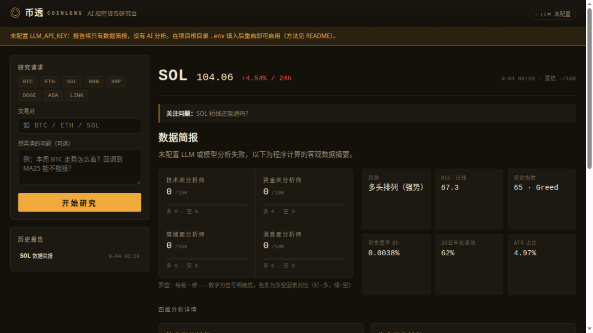

# 币透 CoinLens · AI 加密货币研究台

输入一个交易对，30–90 秒拿到一份「技术 / 资金 / 情绪 / 消息」四维结构化研究报告。



## 它做什么

```
数据采集 ──► 指标计算 ──► 四维分析(LLM) ──► 综合研判 ──► 结构化报告
 K线/行情     MA/RSI/MACD   技术面分析师      研究主管      入场区间/止损/目标
 资金费率     布林/ATR/波动  资金面分析师      多空情景      仓位建议/失效条件
 恐贪指数     支撑/阻力      情绪面分析师                   关键风险
 新闻标题                   消息面分析师
```

核心特点：

- **数据全部来自免费公开接口**，无需注册任何数据服务；
- **客观指标本地计算**后再喂给大模型，模型只做解读、不做"心算"，降低幻觉；
- **每个数据源独立容错**，缺源不缺报告，数据状态在报告尾部如实标注；
- 未配置 LLM 时自动退化为"数据简报"模式，流水线照常可跑；
- 报告以结构化 JSON 落盘（`data/reports/`），可二次开发为日报/推送/回测。

## 快速开始

### 1. 安装并启动

```bash
cd coinlens
cp .env.example .env    # 填入你的 LLM key（见下一节）
./run.sh                # 首次运行自动创建 venv 并装依赖
```

浏览器打开 `http://127.0.0.1:8389`。

> 国内网络装依赖慢可手动执行：
> `pip install -r requirements.txt -i https://pypi.tuna.tsinghua.edu.cn/simple`
>
> 服务器无 python3-venv 时（Debian/Ubuntu）：`sudo apt install python3-venv`，
> 或直接 `pip install --user -r requirements.txt` 后
> `python3 -m uvicorn app.main:app --host 0.0.0.0 --port 8389`

### 2. 配置 LLM（必填，否则只有数据简报）

支持一切 OpenAI 兼容协议的服务，在 `.env` 中改三行即可切换：

| 服务 | LLM_BASE_URL | LLM_MODEL |
|---|---|---|
| 微信 chatapi | `https://chatapi.weixin.qq.com/openai/v1` | 按开通的模型填 |
| DeepSeek | `https://api.deepseek.com/v1` | `deepseek-chat` |
| 智谱 | `https://open.bigmodel.cn/api/paas/v4` | `glm-4.6` |
| OpenAI | `https://api.openai.com/v1` | `gpt-4o-mini` |

```env
LLM_BASE_URL=https://api.deepseek.com/v1
LLM_API_KEY=sk-xxxxxxxx
LLM_MODEL=deepseek-chat
```

> 注意：`LLM_BASE_URL` 只填到 `/v1` 为止，**不要带** `/chat/completions` 后缀（程序自动拼接）。
> key 申请：DeepSeek → platform.deepseek.com；智谱 → open.bigmodel.cn。
> 一次研究约消耗几万 token，DeepSeek 下单次成本通常不到一分钱。

### 3. 使用

1. 页面左侧选择/输入交易对（如 `BTC`，自动补全为 USDT 现货对）；
2. 可选：填写你想弄清的问题（例：「回调到 MA25 能不能接？」），报告会针对性回答；
3. 点「开始研究」，等待 30–90 秒；
4. 报告自动展示：结论 → 四维罗盘 → 操作参考 → 情景推演 → 关键风险 → 四维详情；
5. 左下「历史报告」可随时回看，报告同时以 JSON 存档于 `data/reports/`。

### 4. 手机 / 局域网访问

`run.sh` 默认绑定 `0.0.0.0`，同一 Wi-Fi 下用局域网 IP 访问：

```bash
./run.sh          # 启动时会打印局域网地址，如 http://192.168.x.x:8389
```

连不上的话通常是防火墙拦了端口：`sudo ufw allow 8389`。

## 数据源与网络

| 数据 | 主源 | 备源 | 需要 key |
|---|---|---|---|
| K线 / 行情 | Binance 公开镜像 (data-api.binance.vision) | OKX | 否 |
| 资金费率 / 持仓量 | OKX | Bybit | 否 |
| 恐贪指数 | alternative.me | — | 否 |
| 新闻 | Cointelegraph RSS | CryptoPanic(可选) | 否 |

- 某个源在你所在网络不可达时，改 `.env` 里的 `KLINE_SOURCES` / `DERIV_SOURCES` 顺序即可切换（如 `KLINE_SOURCES=okx,binance`）；
- 想要更高质量新闻，去 cryptopanic.com 申请免费 token 填入 `CRYPTOPANIC_TOKEN`。

## 目录结构

```
coinlens/
├── app/
│   ├── main.py            # FastAPI 入口与路由
│   ├── config.py          # 配置（.env 读取）
│   ├── pipeline.py        # 研究流水线编排（核心）
│   ├── llm.py             # OpenAI 兼容 LLM 客户端
│   ├── indicators.py      # 本地技术指标计算
│   ├── jobs.py            # 后台任务与进度
│   ├── report.py          # 报告存取（data/reports/*.json）
│   └── collectors/        # 数据采集器（行情/衍生品/情绪/新闻）
├── static/                # 前端（原生 HTML/CSS/JS，无外部依赖）
├── tests/
│   └── test_pipeline_mock_llm.py   # 全链路测试（含 mock LLM）
├── docs/                  # 文档与截图
└── data/reports/          # 报告存档（JSON，运行时生成，不入库）
```

## 测试

```bash
PYTHONPATH=. python3 tests/test_pipeline_mock_llm.py
```

用本地 mock LLM 服务器验证完整流水线（真实数据采集 + 四维分析 + 综合研判 + 落盘），无需真实 key。

## API

| 方法 | 路径 | 说明 |
|---|---|---|
| POST | `/api/research` | 发起研究 `{symbol, question?}` → `{job_id}` |
| GET | `/api/jobs/{id}` | 任务进度（阶段、状态、report_id） |
| GET | `/api/reports` | 报告列表 |
| GET | `/api/reports/{id}` | 报告详情（前端渲染所需全部数据） |
| GET | `/api/status` | LLM 配置状态与数据源 |

## 常见问题

- **报告只有数据简报，没有 AI 分析** → `.env` 未配置或 key 无效，看页面顶部黄色横幅和 `/api/status`。
- **某数据源显示"失败"** → 该源在你网络不可达，切换 `.env` 里的源顺序；不影响其他源出报告。
- **改了 `.env` 不生效** → 配置在启动时读取，重启服务：`pkill -f "uvicorn app.main"` 再 `./run.sh`。
- **手机连不上** → 确认同一 Wi-Fi、用启动时打印的局域网地址、放行防火墙 8389 端口。
- **模型输出 JSON 解析失败** → 程序对代码围栏和前后缀做了容错，个别失败会以"该维度分析失败"呈现在报告里并保留其他维度。

## 二次开发方向

- 定时任务：每天自动跑一遍自选清单，生成日报（`pipeline.run_research` 可直接复用）；
- 推送：报告生成后推送到微信（Server酱）/ 邮件 / Telegram；
- 回测：把 `synthesis.plan` 与后续真实行情对比，统计模型研判胜率；
- 内容化：报告 JSON 已结构化，可直接作为信息差平台的内容源。

## 安全提醒

- `.env` 含密钥，已被 `.gitignore` 排除，**永远不要提交到代码仓**；
- 服务默认无鉴权，仅适合个人在可信局域网使用；如需公网暴露，请自行加反向代理 + 鉴权（如 nginx basic auth / Cloudflare Access）。

## 免责声明

本项目聚合公开数据并借助大模型生成解读，**仅供研究学习，不构成任何投资建议**。
加密货币波动剧烈，模型输出可能有误，决策风险自负。
